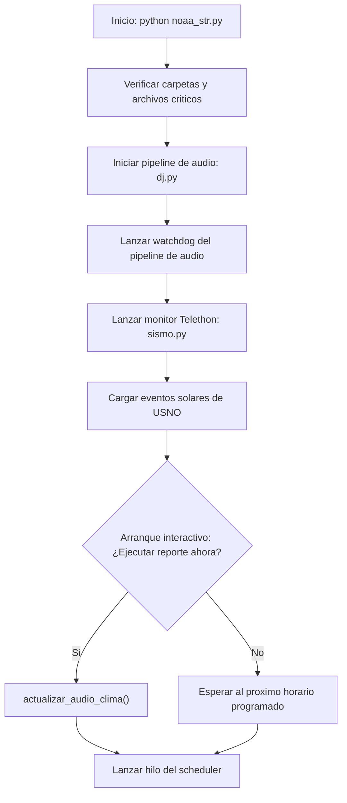
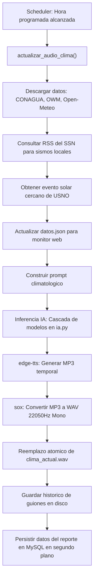
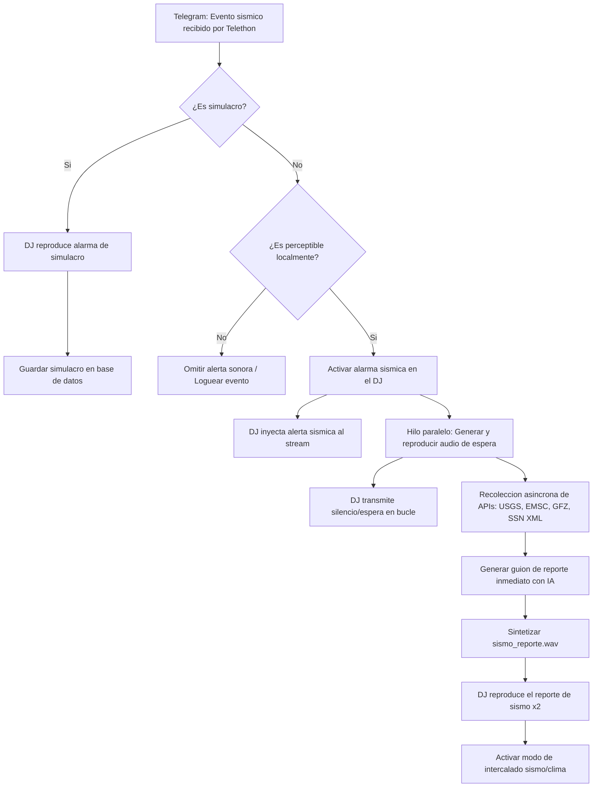

# NOAA Stream

Sistema automatico de transmision radiofonica en vivo (estilo NOAA Weather Radio) con reportes climatologicos actualizados por inteligencia artificial y alertas sismicas prioritarias interactivas.

El proyecto recolecta informacion meteorologica de multiples APIs públicas y gubernamentales, genera guiones adaptados con una cascada de modelos de lenguaje (Google Gemini y Groq LLM), sintetiza la narracion en audio usando Microsoft Edge TTS y transmite el resultado en bucle intercalado con musica local hacia un servidor Icecast y/o una salida fisica analoga (tarjeta de sonido USB conectada a un transmisor FM de baja potencia). Asimismo, cuenta con un monitor en tiempo real del canal de Telegram de SASSLA para inyectar alarmas y reportes de sismo inmediatos enriquecidos con telemetria global.

---

## Caracteristicas Principales

* **Monitoreo Sismico Prioritario**: Escucha permanentemente el canal de alertas de SASSLA via Telegram (usando la biblioteca Telethon). Cuando detecta un evento relevante o un simulacro, detiene la musica o reporte en curso de forma instantanea para transmitir la alarma sonora.
* **Enriquecimiento Sismico Multifuente**: Ante un sismo real, el sistema ejecuta de forma asincrona consultas a la API del Servicio Geologico de EE. UU. (USGS), al Centro Sismologico Euro-Mediterraneo (EMSC), al Centro de Investigacion Aleman de Geociencias (GFZ) y al feed XML del Servicio Sismologico Nacional (SSN) de Mexico. Con esta informacion consolidada, genera mediante IA un guion informativo detallado (magnitud, profundidad, epicentro, distancia local, proyeccion de tsunami) y lo sintetiza para transmitirlo como reporte urgente.
* **Alertas Locales RSS**: Monitorea de forma periodica el feed RSS del SSN para notificar sismos locales especificamente en el estado configurado (por ejemplo, Hidalgo), agrupando eventos cercanos en ventanas horarias especificas.
* **Recoleccion de Datos Meteorologicos**: Consume y normaliza datos provenientes de la Comision Nacional del Agua (CONAGUA/SMN) para el pronostico diario oficial, OpenWeatherMap (OWM) para las condiciones actuales y Open-Meteo AQI para indices de calidad del aire, material particulado (PM10, PM2.5), ozono, monoxido de carbono y profundidad optica de aerosoles (AOD).
* **Efemerides Astronomicas**: Integra la API del Observatorio Naval de EE. UU. (USNO) para extraer fases lunares detalladas, horarios de transito y visibilidad diurna de la luna, asi como eventos solares importantes (equinoccios, solsticios, perihelio y afelio) con lenguaje de proximidad temporal.
* **Redundancia Resiliente de IA**: Genera los guiones utilizando una cascada de fallbacks (Gemini Principal -> Gemini Respaldo -> Gemini Extra -> Groq Llama 3) para garantizar el funcionamiento ininterrumpido del sistema ante fallos de conexion, saturacion de APIs o expiracion de cuotas.
* **Pipeline de Audio Robusto**: Combina herramientas como `edge-tts`, `sox` (para remuestreo de audio a 22050Hz Mono y normalizacion) y `ffmpeg` para alimentar el stream Icecast con bitrates optimizados para voz e internet de bajo ancho de banda.
* **Salida Dual Simulcast**: Permite bifurcar el flujo de audio en tiempo real usando `tee` de Unix, manteniendo la transmision Icecast activa en internet mientras envia el audio directo a un dispositivo ALSA USB local con bucles de recuperacion ante desconexiones fisicas.
* **Base de Datos y Auditoria**: Registra de forma estructurada cada reporte climatologico, datos crudos obtenidos de las APIs, guiones generados, consultas de sismo, errores de ejecucion y fallas de APIs para auditoria tecnica.

---

## Estructura del Proyecto

* **noaa_str.py**: Punto de entrada principal. Configura los horarios de actualizacion, inicializa las APIs, arranca el programador (scheduler), el monitor de sismos y ejecuta el bucle de transmision del DJ (que intercala reportes de clima y pistas musicales de fondo).
* **dj.py**: Motor de audio. Crea el comando de pipeline bifurcado (Icecast + AUX local), inyecta los flujos binarios, reproduce pistas de audio de forma aleatoria, maneja el silencio y corre un watchdog que recupera caidas de la transmision analizando la API HTTP de Icecast o el estado del proceso.
* **sismo.py**: Monitor de red de Telegram para SASSLA. Captura y parsea los mensajes de activacion, realiza validacion de simulacros contra calendario local y cachea las horas programadas para evitar sobrecarga del disco.
* **sismo_flujo.py**: Controla el ciclo de vida de una alerta sismica. Genera la pista corta de espera, reproduce la alarma sonora, consolida los datos de APIs externas y sintetiza el reporte urgente sin sobreescribir el reporte climatologico en curso.
* **sismo_apis.py**: Cliente HTTP para consultas rapidas a APIs sismicas internacionales (USGS, EMSC, GFZ, SSN XML) y calculos de busqueda de replicas.
* **sismo_prompts.py**: Plantillas de prompts especializadas para estructurar la peticion sismica inmediata para la inteligencia artificial.
* **sismo_regex.py**: Coleccion de expresiones regulares utilizadas para extraer datos de los mensajes de SASSLA (magnitudes, ciudades, niveles de intensidad, horarios y tipos de reporte).
* **sismo_utils.py**: Utilidades comunes para alertas sismicas, incluyendo la persistencia del archivo de estado local del ultimo evento.
* **ssn_rss.py**: Lector periodico del feed RSS del SSN de Mexico para la identificacion de sismos historicos del estado local (HGO).
* **meteorologo.py**: Recolecta las condiciones actuales de OpenWeatherMap, indices de calidad del aire e indice UV en Open-Meteo, fases lunares y estaciones solares en la USNO. Interpreta valores tecnicos (como CAPE en altitudes elevadas o punto de rocio critico en spread menor a 2 grados) para traducirlos a etiquetas textuales inteligibles.
* **conagua.py**: Descarga, descomprime y normaliza el pronostico meteorologico diario en formato GZIP de la Comision Nacional del Agua.
* **prompt.py**: Constructor del prompt climatologico. Estructura las fuentes de informacion y aplica un conjunto estricto de reglas de locucion de radio para evitar que la IA alucine datos, repita frases o mencione codigos tecnicos internos.
* **ia.py**: Modulo encargado de la inferencia. Implementa la cascada de llamadas API en reversa (Gemini Principal -> Gemini Respaldo -> Gemini Extra -> Groq) para garantizar la entrega de texto.
* **tts.py**: Administra la sintesis de voz. Llama a `edge-tts` de forma asincrona y transforma el archivo de salida con `sox` al formato WAV maestro de reproduccion (22050 Hz, 16 bits, Mono).
* **bd.py**: Controlador de persistencia MySQL. Administra las inserciones del reporte, datos meteorologicos especificos por API, auditoria de errores y eventos sismicos en la base de datos.
* **config.py**: Configuracion del sistema (claves de API, puertos, limites geograficos, nombres de archivo).
* **noaa_streamDB.sql**: Esquema de base de datos MySQL consolidado v19.0.0. Contiene tablas, indices, llaves foraneas e indices de estadisticas preconfigurados.
* **simulacros.json**: Archivo de configuracion local con las fechas y horas planificadas de simulacros para evitar falsas alarmas en la radio FM.

---

## Flujos de Trabajo del Sistema

### 1. Inicializacion de la Estacion

Al ejecutar `python noaa_str.py`, el sistema realiza los siguientes pasos:
1. Comprueba la existencia fisica del hardware o rutas configuradas (carpetas de musica, archivos de alarmas).
2. Arranca el pipeline de audio en `dj.py`, iniciando la conexion Icecast y, si esta activada, la salida analoga local ALSA.
3. Activa un watchdog de audio en segundo plano.
4. Lanza el cliente Telethon en `sismo.py` para conectarse a Telegram y monitorear el canal de alertas.
5. Realiza una descarga unica de eventos solares de la USNO para el año actual y la almacena en cache RAM.
6. Ejecuta una pregunta interactiva al operador: si la hora actual no coincide exactamente con un horario programado, permite generar el primer reporte climatologico de inmediato o esperar al siguiente slot del scheduler.
7. Arranca el hilo secundario del scheduler (`schedule` en Python).



### 2. Ciclo del Programador Climatologico

En cada horario configurado en `config.HORAS_PROGRAMADAS`:
1. El hilo del scheduler invoca `actualizar_audio_clima()`.
2. Se descargan los datos vigentes de CONAGUA, OWM y Open-Meteo.
3. Se consulta el RSS del SSN para sismos locales.
4. Se calcula si hay un evento solar proximo en la ventana de dias configurada.
5. Se genera un archivo temporal `datos.json` que expone variables de clima estructuradas para servicios web externos.
6. Se construye el prompt de locucion en `prompt.py`.
7. `ia.py` envia el prompt a los modelos de lenguaje en cascada.
8. Una vez obtenido el guion, `tts.py` lo procesa con `edge-tts` y `sox`, actualizando de forma atomica el archivo master `clima_actual.wav`.
9. Se guarda una copia del guion con timestamp en la carpeta historica.
10. Un hilo secundario inserta todos los metadatos recolectados en sus respectivas tablas MySQL (`reportes_climatologicos`, `datos_conagua`, `datos_owm`, `datos_openmeteo`, `prompt_reporte_climatologico`).



### 3. Flujo ante Alertas Sismicas

El flujo sismico posee la prioridad mas alta del sistema y puede interrumpir la transmision regular en cualquier momento:
1. SASSLA publica una alerta en su canal de Telegram; el listener de `sismo.py` captura el texto en milisegundos.
2. Si el mensaje es catalogado como simulacro (por texto o coincidencia de horario de simulacro en `simulacros.json`), activa la alarma sismica en modo simulacro (`REPETICIONES_SIMULACRO` iteraciones), no interrumpe el guion climatologico historico y finaliza.
3. Si es un sismo real y califica como perceptible para las coordenadas configuradas:
   * Activa de inmediato la bandera `estado.alerta_sismica = True`, interrumpiendo el bucle del DJ.
   * El DJ empieza a transmitir en vivo la alarma de sismo real (`REPETICIONES_SISMO_REAL` iteraciones).
   * Paralelamente, en un hilo asincrono en `sismo_flujo.py`, se genera un audio corto de espera que avisa al publico que se esta recolectando informacion.
   * Finalizada la alarma fisica del DJ, el DJ reproduce el audio de espera en bucle.
   * El hilo de recoleccion asincrono consulta USGS, EMSC, GFZ y SSN en tiempo real.
   * Con los datos unificados, el prompt de sismo es enviado a Gemini para redactar un guion informativo oficial urgente de locucion.
   * Se sintetiza el reporte como `sismo_reporte.wav`.
   * Se cambia la bandera `estado.sismo_guion_listo = True`. El DJ sale del bucle de espera, reproduce el reporte urgente dos veces consecutivas, y entra en modo intercalado sismo/clima (reproduciendo un reporte climatologico y un reporte sismico en ciclos consecutivos) durante los siguientes ciclos de actualizacion para mantener informada a la poblacion.
   * Se persisten los datos en la tabla `condiciones_especiales` bajo el tipo `SISMO_SASSLA_REAL`.



---

## Modelo de Base de Datos (MySQL)

El esquema normalizado `noaa_streamDB.sql` se organiza bajo las siguientes tablas:

* **reportes_climatologicos**: Tabla principal. Almacena metadatos del reporte (ID, fecha, hora, ciudad, guion de texto, modelo de IA usado y si el audio fue generado).
* **datos_conagua**: Almacena parametros de temperatura, precipitacion, velocidad/direccion del viento, rafagas, nubosidad y marcas de tiempo provenientes de CONAGUA para hoy y mañana.
* **datos_owm**: Almacena temperatura actual, sensacion termica, presion barometrica a nivel del suelo, humedad, visibilidad, lluvia reciente, nubosidad y horas de amanecer/atardecer desde OpenWeatherMap.
* **datos_openmeteo**: Almacena indices de calidad del aire (AQI), PM10, PM2.5, monoxido de carbono, dioxido de azufre, ozono, indice UV, AOD y polvo en suspension.
* **prompt_reporte_climatologico**: Historial de los prompts especificos enviados a las APIs de IA para auditoria y depuracion.
* **errores_recoleccion**: Bitacora de excepciones de red, fallos de APIs o caidas de sintesis con detalles de la fuente del error.
* **condiciones_especiales**: Bitacora de alertas sismicas reales, simulacros y eventos astronomicos importantes que requieren reportes especiales.

---

## Requisitos de Sistema

### 1. Dependencias del Sistema Operativo (Linux / Debian / Raspberry Pi OS)

* **SoX (Sound eXchange)**: Herramienta de edicion de audio. Debe instalarse con soporte para MP3.
  ```bash
  sudo apt-get update
  sudo apt-get install sox libsox-fmt-all
  ```
* **FFmpeg**: Necesario para leer archivos multimedia y codificar en tiempo real hacia Icecast.
  ```bash
  sudo apt-get install ffmpeg
  ```
* **Icecast2**: Servidor de streaming multimedia (si se transmite a internet).
  ```bash
  sudo apt-get install icecast2
  ```

### 2. Dependencias de Python

El entorno requiere Python 3.9 o superior y las siguientes bibliotecas:
```bash
pip install telethon requests mysql-connector-python schedule edge-tts
```

---

## Instalacion y Puesta en Marcha

1. **Base de Datos**: Importa el archivo `noaa_streamDB.sql` en tu servidor MySQL para crear el esquema de tablas:
   ```bash
   mysql -u usuario -p nombre_bd < noaa_streamDB.sql
   ```
2. **Configuracion**: Copia la plantilla de `CONFIG_SETUP.md` y crea tu archivo local `config.py` en la raiz del proyecto con tus credenciales de base de datos, API keys de OpenWeatherMap, Google Gemini, Groq y credenciales de Telegram para Telethon.
3. **Audios Base**: Asegurate de colocar en la raiz de tu proyecto los archivos de audio requeridos por el DJ:
   * `alerta_sismica.wav`: Alarma sismica oficial.
   * `silencio.wav`: Un segundo de silencio utilizado en las transiciones de reproduccion.
   * Carpeta `pistas_musicales/`: Carpeta con canciones en formato de audio compatibles para intercalar entre reportes de clima.
4. **Ejecucion**: Inicia la estacion corriendo:
   ```bash
   python noaa_str.py
   ```
